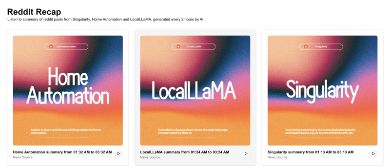
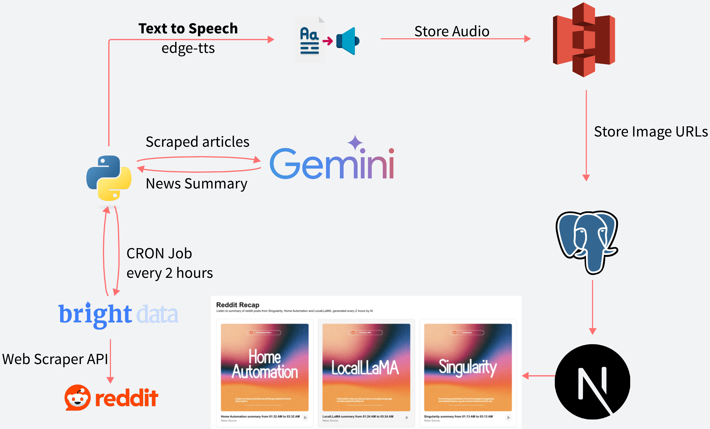

## Reddit Recap: Powered by BrightData!

Let's face it, Reddit is a treasure trove of information, entertainment, and community. But keeping up with your favorite subreddits can feel like trying to drink from a firehose. Endless scrolling, sifting through comments, and trying to distill the important stuff takes time and effort.

That's why I built [**Reddit Recap**](https://reddit-recap-woad.vercel.app/), an app designed to cut through the noise and deliver concise summaries of what's happening in your chosen subreddits, all conveniently available in a beautiful web app – and even as an audio briefing you can listen to on the go!

As a participant in the [BrightData hackathon](https://dev.to/devteam/join-us-for-the-bright-data-web-scraping-challenge-3000-in-prizes-3mg2), I wanted to tackle a personal problem I've faced: staying up-to-date with the latest discussions and news in the communities I care about. Reddit, with its dynamic content and robust anti-scraping measures, presented the perfect challenge.

### The Reddit Scraping Hurdle: Why BrightData Was Essential

Anyone who's tried to scrape Reddit knows it's not a walk in the park. The platform actively blocks traditional scraping methods, making it incredibly difficult to reliably collect the data you need. IP blocking, CAPTCHAs, and constantly evolving page structures are just some of the obstacles.

This is where **BrightData** came to the rescue. Their robust web scraping infrastructure and pre-built datasets are specifically designed to overcome these challenges. For Reddit Recap, I leveraged BrightData's [Web Scraper API](https://brightdata.com/products/web-scraper), which provides structured and reliable access to Reddit posts and information, bypassing the complexities of building and maintaining my own scraping infrastructure.

This was a game-changer! Instead of spending countless hours battling anti-scraping techniques, I could focus on the core logic of my app: summarizing and presenting the information in a user-friendly way.

### How Reddit Recap Works: A Peek Under the Hood

Here's a breakdown of the process behind Reddit Recap, as illustrated in the architecture overview:

1. **Targeted Scraping with BrightData:** Using the [BrightData API](https://brightdata.com/cp/data_api/gd_lvz8ah06191smkebj4/subreddit_url?tab=overview), I can efficiently pull the latest top posts from designated subreddits like [r/singularity](https://www.reddit.com/r/singularity/), [r/LocalLLaMA](https://www.reddit.com/r/LocalLLaMA/), and [r/homeautomation](https://www.reddit.com/r/homeautomation/). BrightData handles the heavy lifting of navigating Reddit's structure and bypassing any blocking mechanisms. This is triggered by a **CRON job that runs every 2 hours**, powered by [GitHub Actions](https://github.com/features/actions).

2. **News Summary with Gemini:** The raw scraped data is then fed into a Python script (`llm.py`) which utilizes **Google Gemini**. A carefully crafted prompt instructs Gemini to summarize the key news and discussions from the scraped posts, acting like a professional news anchor delivering concise updates. The prompt also specifies the subreddit and the time window for the summary, adding valuable context.

3. **From Text to Voice:** To make consuming information even easier, the summarized text is then passed to a Text-to-Speech engine, specifically **edge-tts**. This generates a natural-sounding audio file of the news summary.

4. **Storing the Audio:** The generated audio files are then uploaded to **Amazon S3** for storage. This allows for easy streaming and access within the web application.

5. **Database for Tracking:** The URL of the stored audio file in S3 is then recorded in a **PostgreSQL database**. This helps manage and link the audio summaries within the web app.

6. **Web App:** Finally, the summarized text and the link to the audio file are presented in an intuitive and visually appealing web application. You can read the summary or simply hit play to listen to the latest Reddit recap for your favorite communities.

**Specifically, How BrightData Makes a Difference:**

The code snippets reveal the core of the BrightData integration:

- **`reddit.py`:** This file handles the communication with BrightData's API. The `create_reddit_scraping_task_using_subreddit` function demonstrates how a scraping task is initiated for a specific subreddit. Crucially, the `get_reddit_scraping_tasks` function leverages the `poll_scraping_tasks` function (in `common.py`) to ensure the data is fully available before proceeding. This reliable data retrieval is the key benefit of using BrightData.

- **`.github/workflows/scrape_posts.yaml`:** This workflow showcases how the scraping and summarization process is automated on a schedule using GitHub Actions, ensuring the 2-hour update frequency.

Without BrightData, building this application would have been significantly more complex and time-consuming. The focus would have been on overcoming technical scraping challenges rather than delivering valuable summarized content to users.

### The Benefits of Reddit Recap

Reddit Recap offers several key advantages for busy individuals:

- **Stay Informed Effortlessly:** No more endless scrolling! Get the gist of what's happening in your favorite subreddits in minutes.
- **Audio Summaries on the Go:** Listen to your Reddit news during your commute, workout, or while doing chores.
- **Time Savings:** Reclaim valuable time by quickly catching up on relevant discussions.
- **Clean and Organized Presentation:** The web app provides a clear and easy-to-navigate interface for accessing the summaries.
